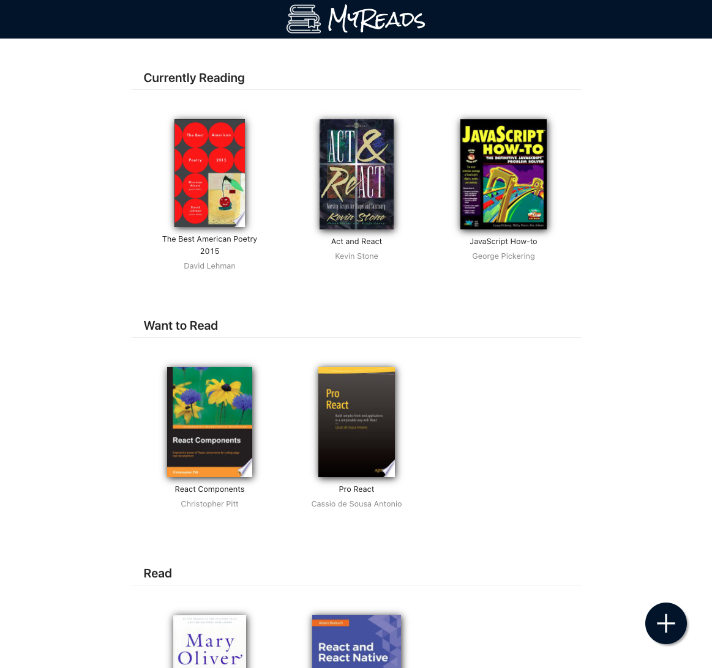
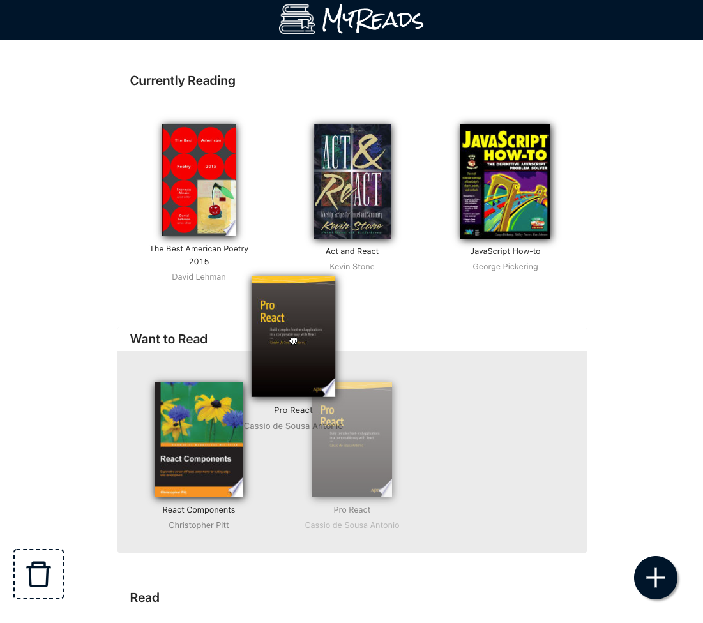
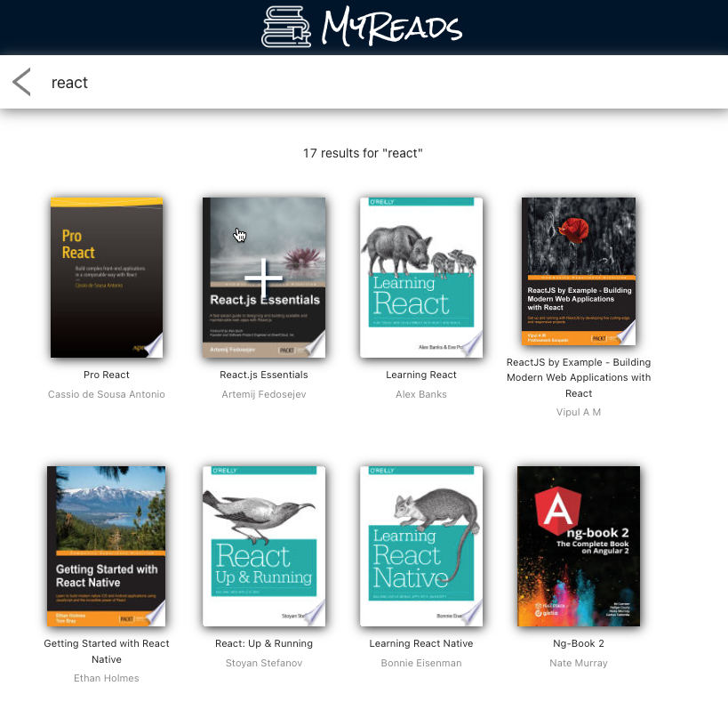
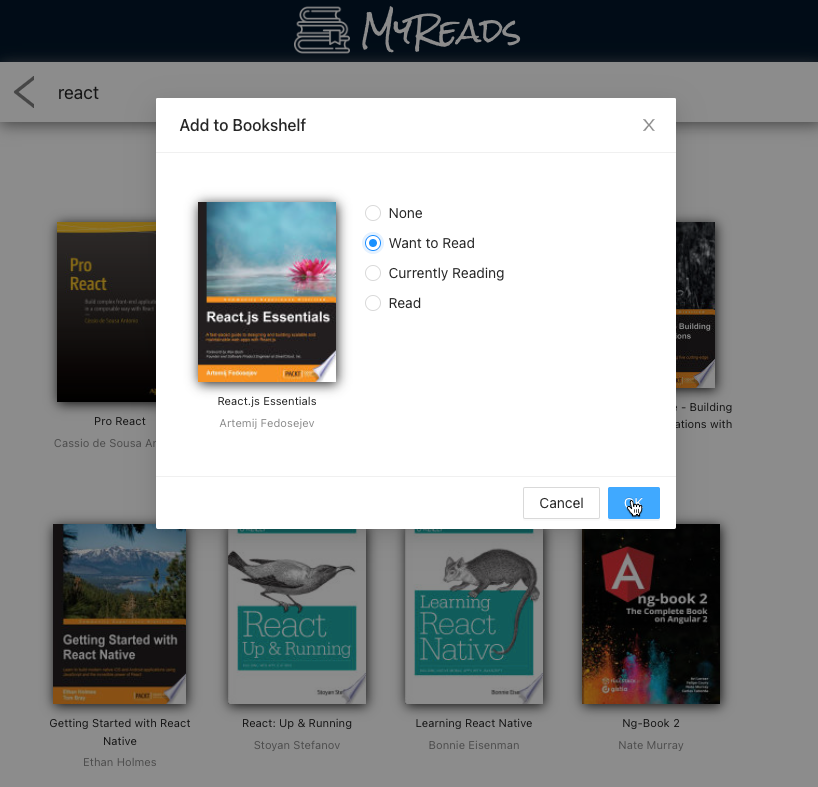

<!-- PROJECT LOGO -->
 

  

<h3 align="center">MyReads</h3>
  

    A Book Tracking App
     
  

## About
* This Book Tracking App allows you to select and categorize books you have read,
you are currently reading, or want to read.

    

 

* Easy Drag'n'Drop interface to categorize books 

    

* Add new books to your shelf via the search bar:

    
    

## Instructions
After cloning, from within the repository run:

### `npm install`
Installs the required dependencies.

### `npm start`
Runs the app in the development mode.\
Open [http://localhost:3000](http://localhost:3000) to view it in your browser.

### `npm run build`

Builds the app for production to the `build` folder.

## Acknowledgments
This project was bootstrapped with [Create React App](https://github.com/facebook/create-react-app). 
The app has been built with a great contribution of the following libraries:
+ [Ant Design](https://ant.design/)
+ [dnd kit](https://github.com/clauderic/dnd-kit)